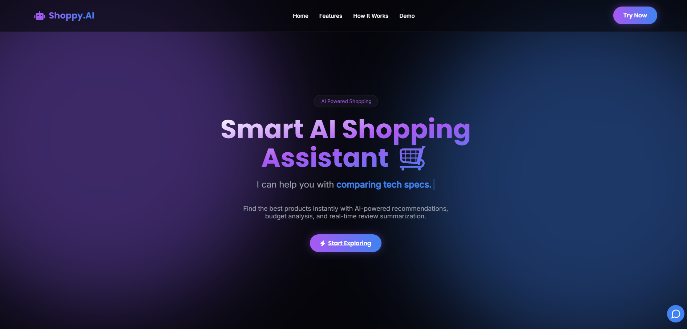
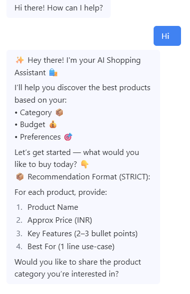
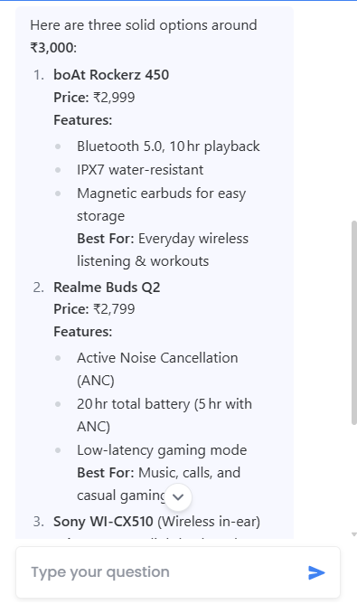

# 🛒 AI Shopping Assistant

> 🚀 An AI-powered shopping assistant that helps users discover the best products based on their needs, budget, and preferences with a modern futuristic UI.

---

## 🌐 Live Demo

👉 [Click to Explore the Website](https://ai-shopping-assistant-kohl.vercel.app/)

---

## 📌 Overview

AI Shopping Assistant is a **smart conversational AI system** designed to simplify the product discovery process.  

It interacts with users step-by-step, understands their requirements, and provides **structured product recommendations** with pricing, features, and best-use cases.

> 🎯 Built to simulate real-world AI-driven e-commerce assistants.

---

## ✨ Features

* 🤖 AI Chatbot-Based Shopping Assistant  
* 🎯 Step-by-Step Product Recommendation Flow  
* 💰 Budget-Based Filtering System  
* 🧠 Smart User Input Understanding  
* ⚡ Real-Time AI Responses  
* 🎨 Futuristic UI (Glassmorphism + Neon Effects)  
* 📊 Structured Product Output Format  
* 📱 Fully Responsive Design  

---

## 🧠 How It Works

The assistant follows a **guided recommendation pipeline**:

1. 📦 User enters product requirement  
2. 🎯 AI identifies product category  
3. 💰 System asks for budget  
4. 🧠 AI processes preferences  
5. 🛍️ Generates top 3 product recommendations  

👉 Each recommendation includes:
- Product Name  
- Price  
- Key Features  
- Best Use Case  

---

## 💡 User Flow

1. User clicks **"Start Exploring"** 🚀  
2. Chatbot initiates conversation 🤖  
3. User provides:
   - Product type  
   - Budget  
4. AI processes input  
5. 🎯 Displays structured recommendations  

---

## 🛠️ Tech Stack

* **Frontend:** HTML5, CSS3, JavaScript  
* **UI Design:** Glassmorphism + Neon Effects  
* **Animations:** CSS + JavaScript  
* **AI Integration:** Flowise + OpenRouter  
* **Deployment:** Vercel  

---

## 📂 Project Structure

```
📁 AI-Shopping-Assistant
│── README.md
│── index.html
│── screenshot_1.png
│── screenshot_2.png
│── screenshot_3.png
```

---

## 🚀 Getting Started

### 1️⃣ Clone the Repository

```bash
git clone https://github.com/your-username/AI-Shopping-Assistant.git
```

2️⃣ Open the Project

Simply open:

```bash
index.html
```

✅ No installation required
✅ No dependencies

---

## 📸 Screenshots

### 🔥 Main Interface



---

### 🤖 Chatbot Interaction

<p align="center">
  
  
</p>

---

## 🔮 Future Enhancements

* 🛍️ Real Product API Integration
* 📊 Price Comparison Engine
* 🧾 Review Summarization
* 🤖 Personalized Recommendation Memory
* 🌐 Backend Integration (Node.js / Python)
* 📈 User Preference Analytics

---

## 🤝 Acknowledgements

💡 Built as part of experimentation with AI-powered shopping assistants and conversational interfaces.

---

## 📬 Connect with Me

**Daksh Khandelwal**
1st Year BS in AI & Data Science @ IIT Jodhpur  
📧 dk.khandelwaliitj@gmail.com  
🔗 [LinkedIn Profile](https://www.linkedin.com/in/daksh-khandelwal-b02748391/)
